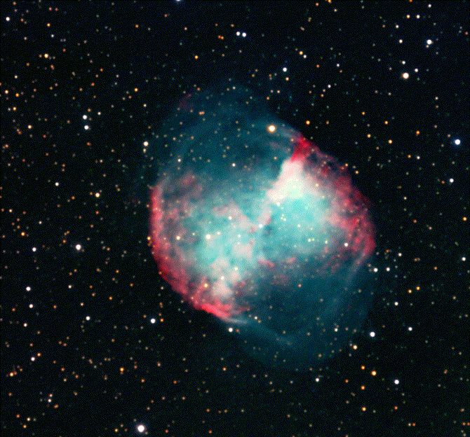
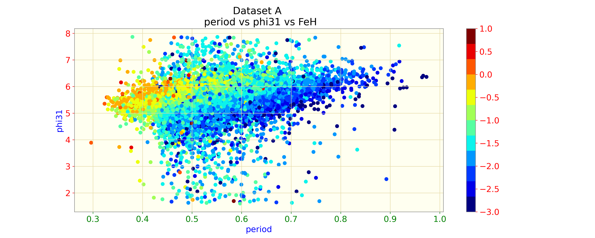
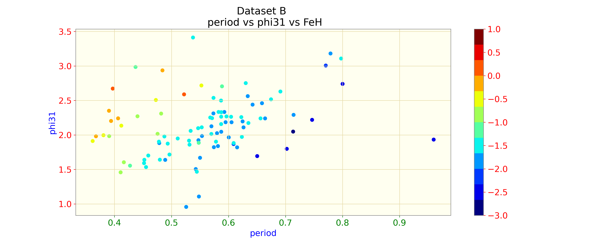
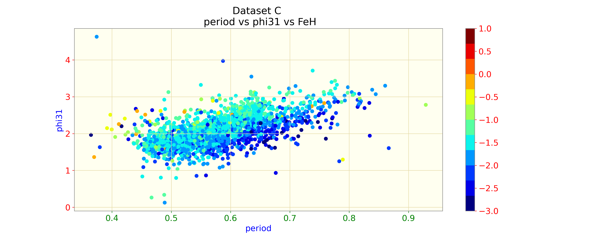
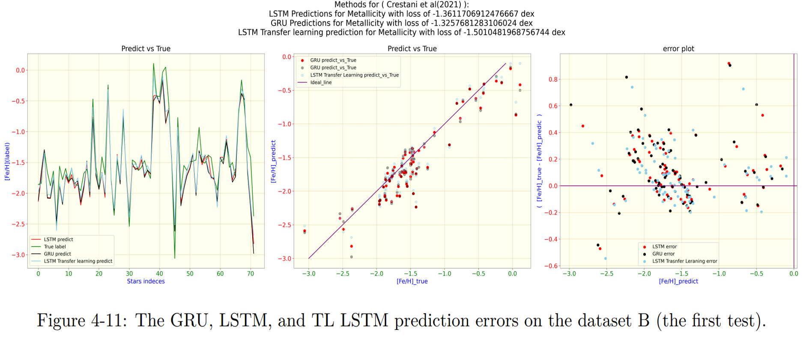

#### Testing deep learning and machine learning methods to estimate the metallicity of RR Lyrae stars from the shape of their light curves

RR Lyrae stars are invaluable as chemical tracers due to their well-established link between heavy-element
abundance and light curve features. However, achieving precise and consistent calibration across diverse
photometric wavelengths has posed a persistent challenge. Numerous pioneering studies have proposed
cutting-edge techniques to address this issue. In this project, we employ a combination of machine learning
and three deep learning approaches. Our machine learning approach explores the feasibility of predicting
metallicity from the Fourier Transform parameters of RRL light curves, while the three deep learning methods
aim to perform regression from one photometric band to another. In essence, we first employ an existing
metallicity prediction method on extensive photometric datasets, followed by the training of three Recurrent
Neural Network (RNNs) to regress [Fe/H] values based on light curves in alternate wavelength bands. These
three RNNs include the Long Short-Term Memory RNN, the Gated Recurrent Unit (a faster and simpler
version of LSTM), and a transfer-learned LSTM that enhances the capabilities of the initial LSTM for the
metallicity prediction of new Gaia data release. Morover, as an initial step, I have implemenetd an XGBoost as well.

#### The datasets:

#### The final result:

#### The Comparison between the methods:
\begin{table}[!ht]
    \centering
    \begin{tabular}{c | c | c | c | c | c}
    \hline
    model&data(train)&data(predict)&regression task&tunning&log rmse error(dex)\\
    \hline
    XGB & A & A & no & yes & -1.45 \\
    \hline
    XGB & B & B & no & yes & -0.89 \\
    \hline
    XGB & C & C & no & yes & -1.14\\
    \hline
    LSTM & A & B & yes & yes & -1.36 \\
    \hline
    GRU & A & B & yes & yes & -1.32 \\
    \hline
    TL LSTM & A to B & B & yes & yes & -1.50 \\
    \hline
    \end{tabular}
    
    \caption{conclusion}
    \label{tab:my_label}
\end{table}

